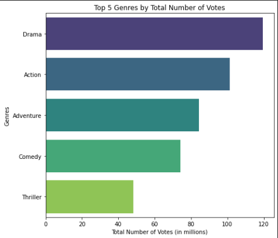
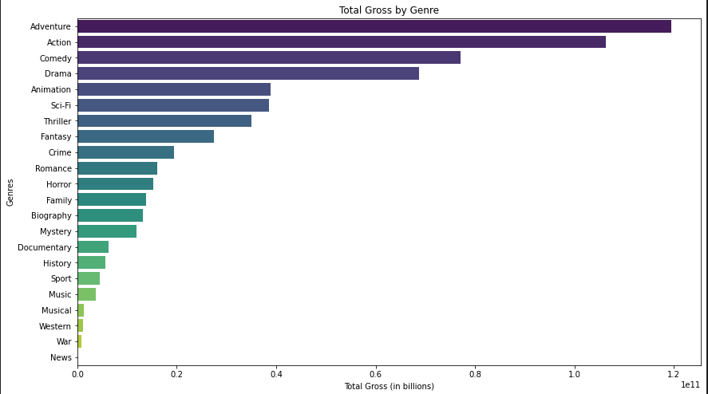

## Moringa Phase 1 Project
**1. Overview**

The head of Microsoft wants to create a new movie studio, but they don't know anything about creating movies.
 - This project explores the top 5 genres consumers of movies love best, it also explores what genres have the highest return on investment as well as the recommended movie runtimes.
- With the three insights I believe that the head of Microsoft will have a clear direction to move with the new movie studio.

**2. Business Understanding**

In this section will be talking about the stakeholder in this project whom I would say is the head of Microsoft a well as Microsoft as a company because it is in their best interest in having actionable insights for the company.

While trying to understand how to generate the actionable insights, I set three key business questions which include: 
- What are the top 5 genres that consumers love?
- What are the genres that generate the highest gross?
- What is the recommended average movie runtimes?

I set the above questions because:
- I saw that since Microsoft is new in the industry it needs to understand the consumer favourites in order to invest in film genres that consumers would engage with.
- It was also crucial for Microsoft to invest in films that would give them a high ROI(Return on Investment)
- It was also necessary to understand on average how long films should be.

**3. Data Understanding and Analysis**

In this project I have worked on two sources of data: the im.db database and the bom.movie_gross.csv file.
- I turned the two sources of data and turned them into DataFrames using pandas and sqlite modules. 
- I focused on the movie_basics and movie_ratings tables and stored them in a imdb_df. This data provided me insights on the average ratings, list of genres as well as the runtime_minutes data.
- The bom.movie_gross.csv file gave me insights on domestic and foreign gross.
- Below contains three visualizations of the insights gathered.

This visualizes the Top 5 genres based on the Total No of votes

This visualizes the Total gross per every genre

This visualizes the average and recommended movie runtime minutes

**4. Conclusion**

I would like to recommend the head of Microsoft the following based on my insights:
- The genres that I would recommend Microsoft to launch in the movie studio are Adventure, Drama, Comedy and Action. This is because these genres not only generate the highest domestic and foreign gross but also they are also seen to be consumer favourites.
- I would also recommend that most films should range between 105.5 mins to 135.5 mins based on the range of the movie runtimes produced before. This so that the users will be able to effectively engage with the movie without loosing interest.
